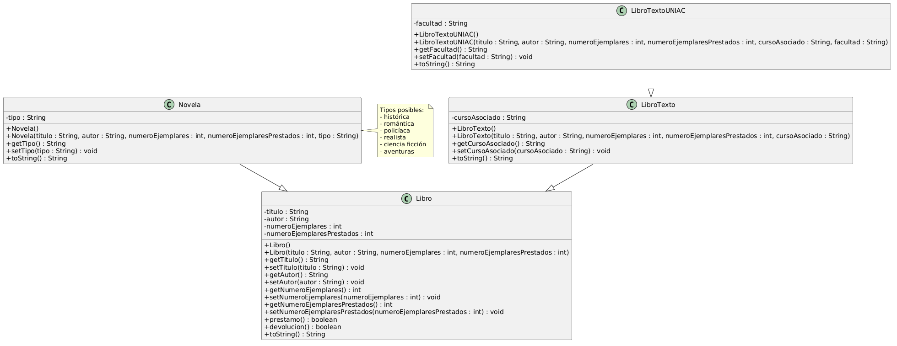

## Propuesta de mejoras al sistema

### Nuevos atributos

1. **añoPublicacion (int)**  
Permitiría conocer el año en que fue publicado el libro, lo cual ayuda a organizar el catálogo de la biblioteca.

2. **categoria (String)**  
Permitiría clasificar los libros según su temática, por ejemplo: literatura, ciencia, historia, tecnología, etc.

### Método adicional

**ejemplaresDisponibles()**

Este método permitiría conocer cuántos ejemplares del libro están disponibles para préstamo.

Ejemplo de implementación en la clase Libro:

```java
public int ejemplaresDisponibles() {
    return numeroEjemplares - numeroEjemplaresPrestados;
}

# Sistema de Gestión de Biblioteca

Proyecto desarrollado en Java usando Programación Orientada a Objetos.

## Diagrama UML

